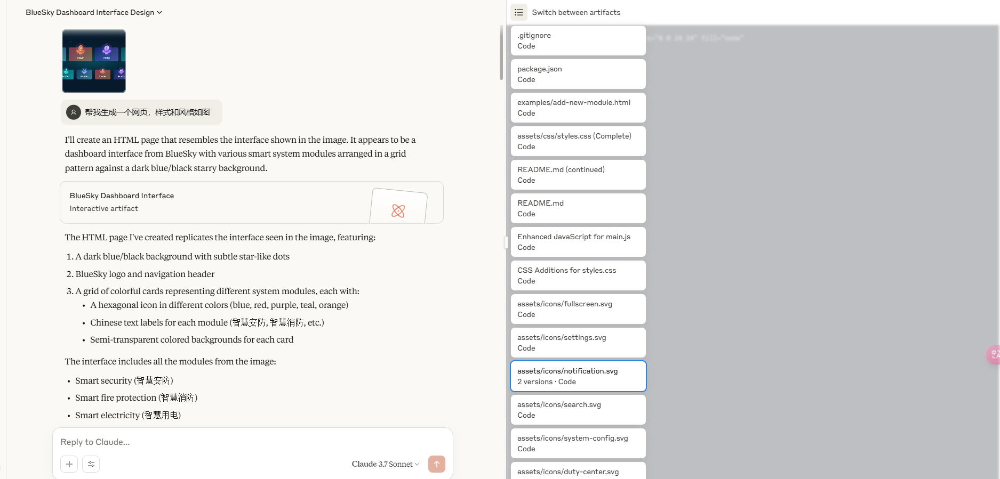
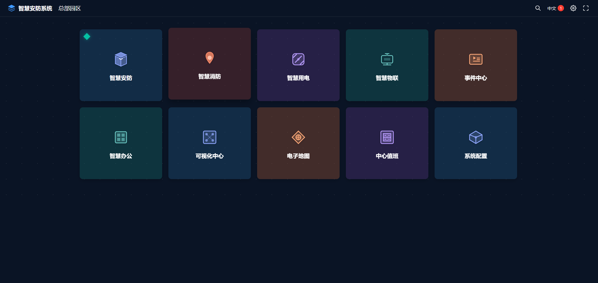
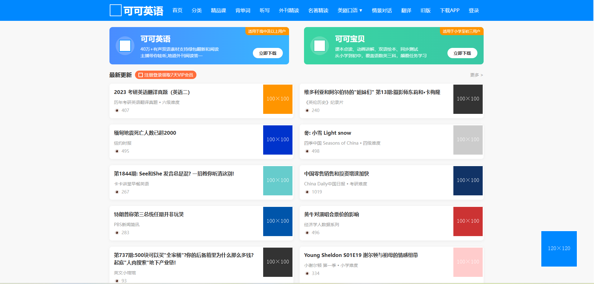
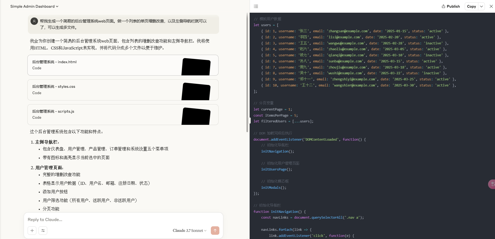
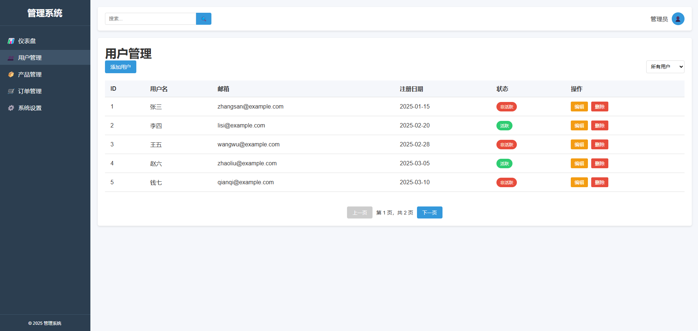
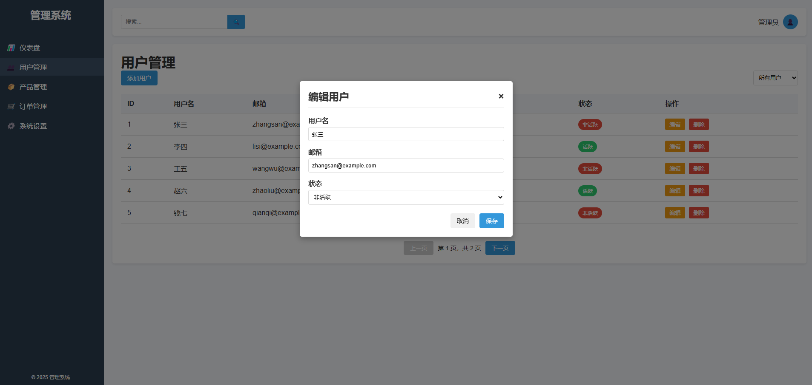

# claude根据效果图生成web页面

如何根据一张效果图，就生成自己想要的网页呢？我尝试了很多ai工具，效果都不尽人意。诸如：秘塔、deepseek、gemini、chatgpt。直到发现**claude**，生成的网页效果确实惊艳！

## 简介
`Claude` 是由人工智能公司 Anthropic 开发的多模态人工智能工具，它在今年2月份推出了市场上首个混合推理模型`Claude 3.7 Sonnet`。

`Claude 3.7 Sonnet` 的核心优势在于其独特的双重模式。它既是一个普通的大型语言模型，也是一个强大的推理模型，用户可以根据需求选择模型是快速给出答案。

体验地址：
[https://claude.ai/](https://claude.ai/)

## 案例一：安防系统首页面
找到一个安防系统首页面，上传。

生成的文件都在右侧页面，可以随意点选切换。

**生成效果**

可以说生成的效果和原图比较接近了。离谱的是它连svg都自动生成了。

## 案例二：可可英语仿站
来个稍微复杂一点的，随手找个英语网站截图。

**原图**

**生成效果**

炸裂！！！！

## 案例三：也可以直接根据文字命令生成网页
来一个简易的后台管理系统

**输入命令**

**效果图**

**交互**也是可以的：

## 扩展
服务端代码的生成效果也相当可以。可以用来生成小工具嵌入到网站中。