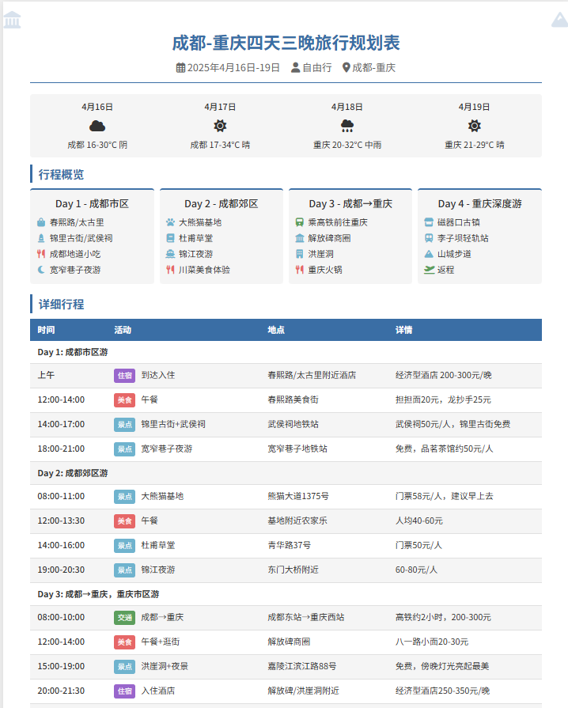

# 高德

## 写在前面

**参考资料** [https://juejin.cn/post/7487219720480702527](https://juejin.cn/post/7487219720480702527)

**我的样例** [https://github.com/yijiebaiyi/travel_guide](https://github.com/yijiebaiyi/travel_guide)

## 操作步骤

### 1. 登录高德开放平台

地址： [https://lbs.amap.com/](https://lbs.amap.com/)

打开控制台 -> 新建应用 -> 添加web服务key -> 复制key备用

### 2. 安装nodejs，保证npx命令可以执行

### 3. 打开cursor，配置高德MCP

设置 -> MCP -> Add new globle MCP server

修改mcp.json文件：

**windows:**
```json
{
    "mcpServers": {
        "amap-maps": {
            "command": "cmd",
            "args": [
                "/c",
                "npx",
                "-y",
                "@amap/amap-maps-mcp-server"
            ],
            "env": {
                "AMAP_MAPS_API_KEY": "这里这里！！！粘贴您在高德官网上申请的key"
            }
        }
    }
}
```

**mac:**
```
{
    "mcpServers": {
        "amap-maps": {
            "command": "npx",
            "args": [
                "-y",
                "@amap/amap-maps-mcp-server"
            ],
            "env": {
                "AMAP_MAPS_API_KEY": "这里这里！！！粘贴您在高德官网上申请的key"
            }
        }
    }
}
```

### 4. 检查MCP Servers `amap-maps`是否可用
### 5. 在Cursor中写提示词

示例： 
```
使用高德MCP，帮我制作成都和重庆的4天3晚旅游攻略
```
AI会自动调用MCP工具， 我们需要一步步点击后面的执行。
### 6. 值作网页提示词

提示词：
```
你是一位优秀的平面设计师和前端开发工程师，帮我生成旅游规划的网页，要求适配H5。
```
>这里模型推荐claude-3.7-sonnet

你也可以把所有的需求写入文件，然后在命令框调用。可以按照自己的需求尽可能详细地描述。

### 效果图
