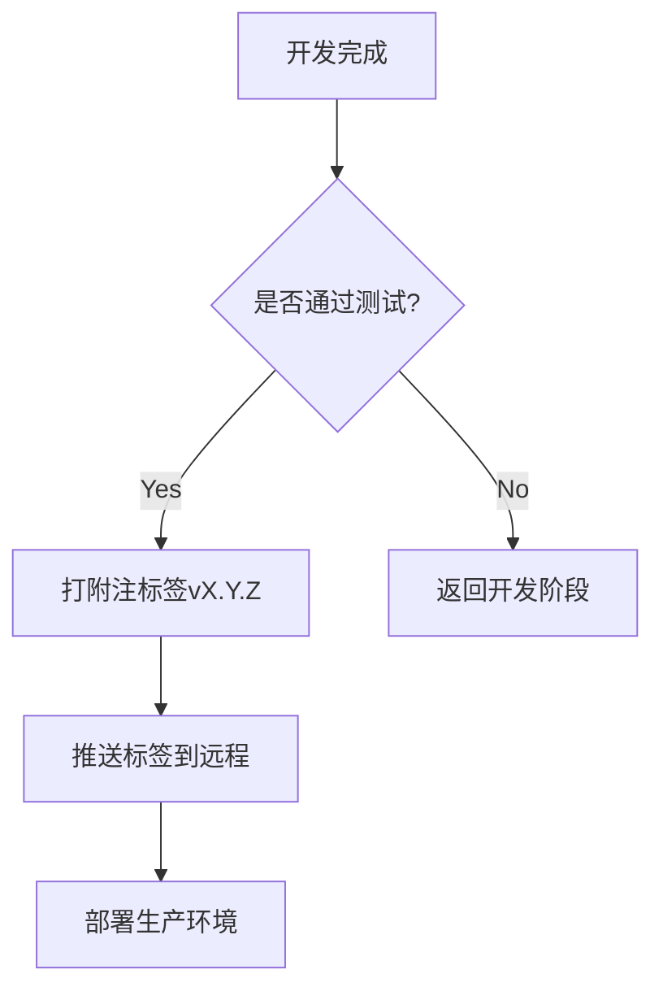

# Git标签（Tag）的作用、命令与版本管理

## 一、Git标签的作用
Git标签（Tag）是代码版本管理的重要工具，主要用于 **标记特定提交（commit）** ，实现以下核心功能：

1. **版本快照的永久标识**  
   Tag会永久指向某个commit，即使后续代码更新，该tag仍指向原始commit，形成不可变的版本快照。  
   *示例*：`v1.0.0`可精确对应到生产环境发布的代码版本。

2. **增强版本可读性**  
   用语义化标签（如`v2.3.0-beta`）替代难以记忆的commit哈希值（如`9fceb02`），便于快速定位关键版本。

3. **支持快速回滚与追溯**  
   当线上代码出现故障时，直接切换到稳定tag对应的版本进行紧急修复。

4. **分支开发的里程碑标记**  
   在分支合并或功能发布时打tag，标记开发阶段的重要节点。

---

## 二、标签与分支的区别
| **特性**         | **标签（Tag）**                  | **分支（Branch）**               |
|------------------|----------------------------------|----------------------------------|
| **移动性**       | 静态，指向固定commit             | 动态，HEAD指针随提交移动          |
| **使用场景**     | 版本发布、历史回溯               | 功能开发、多人协作               |
| **存储方式**     | 仅存储commit引用（轻量标签）     | 存储一系列commit构成的链式结构    |
| **修改权限**     | 只读                             | 可读写                           |
| **生命周期**     | 永久保存（除非手动删除）         | 临时存在（合并后通常删除）         |


---

## 三、标签操作命令大全
### 1. 创建标签
| **命令**                                      | **说明**                                 |
|-----------------------------------------------|-----------------------------------------|
| `git tag v1.0`                                | 创建轻量标签（无元数据）                 |
| `git tag -a v1.0 -m "Release version 1.0"`    | 创建附注标签（含作者、日期、描述信息）   |
| `git tag v1.2 9fceb02`                        | 给指定commit打标签                      |


### 2. 查看标签
```bash
git tag                  # 列出所有标签
git show v1.0            # 查看标签详细信息
git tag -l "v1.*"        # 按模式搜索标签
```

### 3. 推送与同步
```bash
git push origin v1.0     # 推送单个标签
git push origin --tags   # 推送所有未同步的标签
```

### 4. 删除标签
```bash
git tag -d v1.0          # 删除本地标签
git push origin :refs/tags/v1.0  # 删除远程标签（需先删本地）
```

### 5. 检出标签
```bash
git checkout v1.0        # 切换到标签（进入分离头指针状态）
git checkout -b fix-v1.0 v1.0  # 基于标签创建新分支
```

---

## 四、版本管理实战流程
### 场景：发布新版本并处理紧急Bug
**步骤1 - 创建发布标签**
```bash
# 在master分支完成测试后打标签
git checkout master
git tag -a v2.3.0 -m "正式发布版本2.3.0"
git push origin --tags
```


**步骤2 - 发现Bug并回滚**
```bash
# 检出标签创建修复分支
git checkout -b hotfix-2.3.1 v2.3.0

# 修复代码后提交并打新标签
git commit -m "修复登录验证漏洞"
git tag v2.3.1
git push origin hotfix-2.3.1 --tags
```

**步骤3 - 合并修复到主分支**
```bash
git checkout master
git merge hotfix-2.3.1
```

**步骤4 - 清理旧标签（可选）**
```bash
git tag -d v2.3.0        # 删除本地过期标签
git push origin :refs/tags/v2.3.0  # 同步删除远程标签
```

---

## 五、实战建议
1. **命名规范**  
   使用语义化版本控制（SemVer）：`主版本.次版本.修订号`，如`v2.1.3`。

2. **标签类型选择**  
   - **轻量标签**：临时内部测试版本
   - **附注标签**：正式发布版本（推荐存储完整元数据）

3. **自动化集成**  
   结合CI/CD工具（如Jenkins、GitHub Actions），在通过测试后自动打标签。

4. **文档关联**  
   在标签描述中附加发布文档链接或变更日志。

