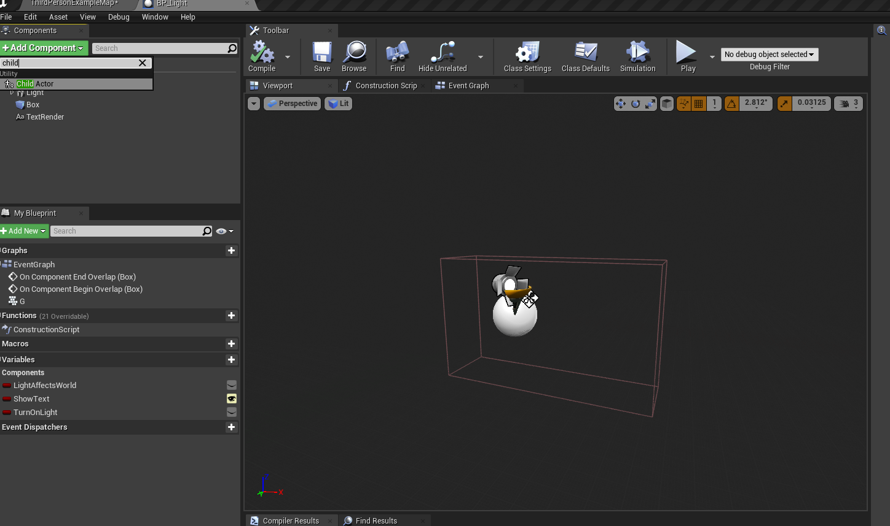
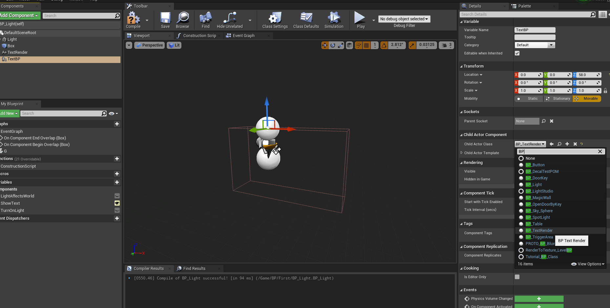
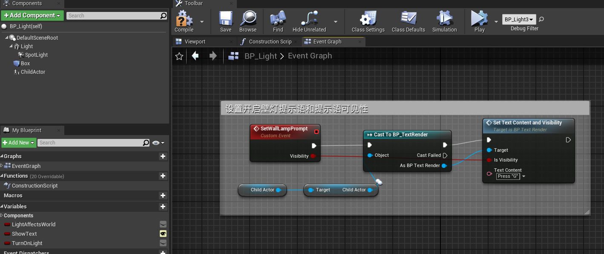

# 蓝图中添加一个蓝图组件

我们需要在蓝图中添加另一个蓝图组件，方便我们使用，并调用它的方法。

## 实例
例如：我们需要做一个靠近壁灯，就显示提示文字的效果。 需要在壁灯中添加一个我们创建好的文字蓝图类组件。

## 步骤：

1. **创建壁灯蓝图类**：
   - 首先，你需要有一个壁灯蓝图类，这应该是你想要在场景中创建的主要对象。

2. **创建文字蓝图类**：
   - 文字蓝图类也要先创建好。它通常是一个`Text Render`组件或者是包含文字渲染功能的蓝图。

3. **在壁灯蓝图中添加文字蓝图**：
   - 打开壁灯蓝图类，进入其编辑界面。
   - 在**Components**面板中，点击**Add Component**按钮。
   - 选择**Child Actor**组件（它允许你将其他蓝图作为子组件添加到当前蓝图中）。
   
   - 将**Child Actor**组件拖拽到合适的位置（比如壁灯上方或者前面）。
   - 在**Child Actor**组件的属性中，选择你创建的文字蓝图类（在Actor Class中选择你的文字蓝图类）。

   

4. **调整文字位置**：
   - 通过调整文字蓝图的位置、旋转和缩放属性，确保它显示在壁灯上方或你想要的位置。

5. **在壁灯蓝图中触发文字蓝图事件**
   - 我们在文字蓝图中暴露了修改文字内容和可见性的方法或者事件，然后我们可以在壁灯蓝图中调用它。

6. **在场景中实例化壁灯**：
   - 现在，你可以将多个壁灯蓝图拖到场景中，每个壁灯实例都会自动包含文字蓝图作为子组件。
   - 这样，你就不需要一个一个手动添加文字蓝图了，而且如果需要修改文字的属性，只需要修改文字蓝图类本身。

## 优势：
- 通过这种方式，我们能够将文字蓝图与壁灯蓝图解耦，使得多个壁灯都能使用相同的文字蓝图。
- 只要修改文字蓝图中的内容，所有附加该文字蓝图的壁灯实例都会自动更新。
