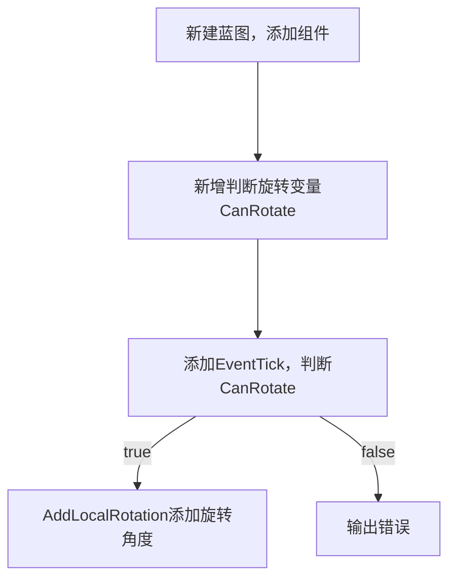
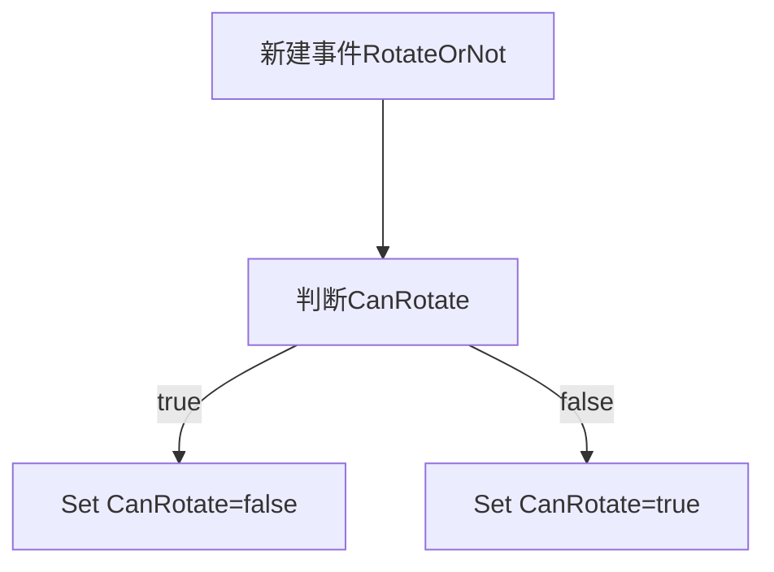
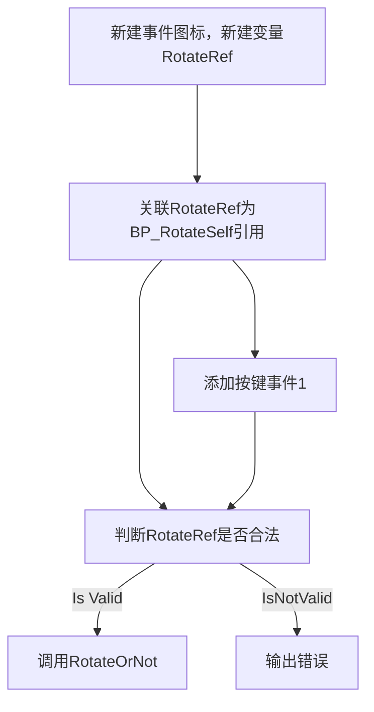

# 按键实现物体自转

## 效果说明
当角色按下键盘1键，场景中某个Actor就会自转。我们可以直接在同一个蓝图实现这个功能。

## 实现思路
使用两个蓝图类来实现，用到`蓝图通信`。

### 蓝图1：新建自身旋转蓝图BP_RotateSelf
 
 

#### 自身旋转逻辑

 
 

#### 旋转自定义事件

### 蓝图2：现有的第三人称角色蓝图 `ThirdPersonCharacter`

## 实现效果
<iframe src="https://player.youku.com/embed/XNjQ3MDQ0MzE4NA" scrolling="no" border="0" frameborder="no" width="800" height="450" framespacing="0" allowfullscreen="true"></iframe>

