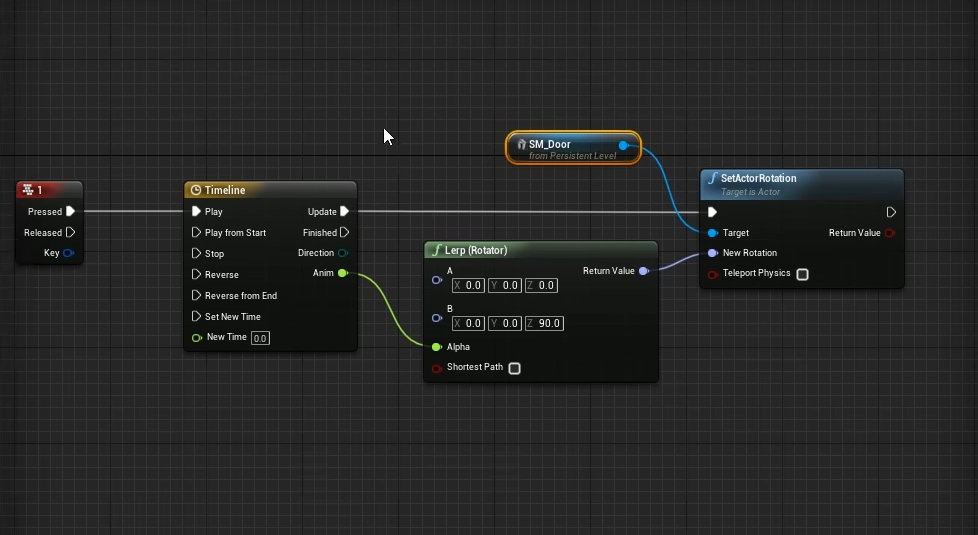
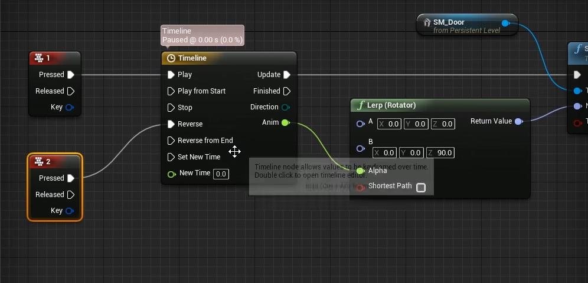
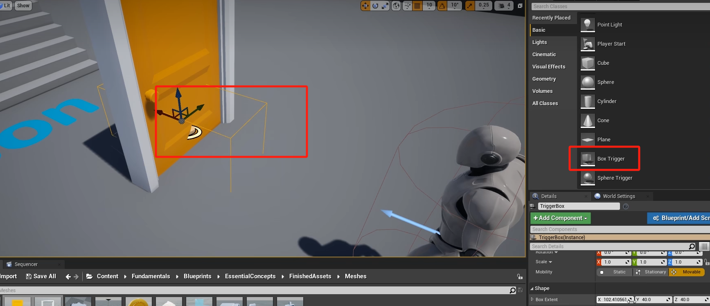
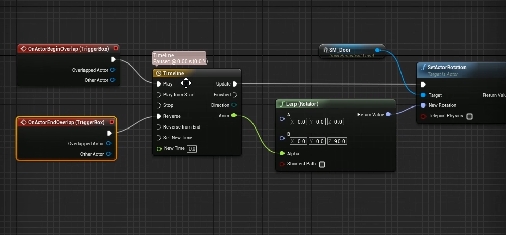

# 蓝图基础
## 一、蓝图概述
### 1. 定义
在Unreal Engine（UE）中，蓝图是一种可视化的脚本系统。它允许用户在不编写大量代码的情况下创建游戏逻辑、交互等功能。蓝图本质上是一系列的节点连接，这些节点代表了不同的操作、事件或数据。
### 2. 作用
快速原型制作：对于游戏开发者来说，尤其是初学者或者想要快速验证某个游戏机制的开发者，蓝图提供了一个便捷的方式。例如，在创建一个简单的射击游戏中，通过蓝图可以快速实现枪支射击逻辑，包括子弹发射、碰撞检测等功能。
- 非程序员参与开发：设计师等非程序员人员可以利用蓝图来调整游戏中的交互元素。比如，在一个角色扮演游戏中，设计师可以通过蓝图设置角色的对话系统，根据不同的任务状态显示不同的对话内容。
- 可视化逻辑编辑：将复杂的游戏逻辑以可视化的方式呈现出来，便于理解和调试。例如，在创建一个解谜游戏时，蓝图可以清晰地展示谜题的触发条件和解决逻辑。

---

## 二、蓝图的类型
### 1.关卡蓝图
主要用于处理关卡级别的事件和逻辑。例如，当玩家进入某个特定区域时触发一个事件，像开启一扇门或者启动一个陷阱。
#### 创建与使用
在UE编辑器中，每个关卡都有对应的关卡蓝图。可以通过双击关卡蓝图文件在蓝图编辑器中进行编辑。在关卡蓝图中，可以连接各种事件节点，如“Begin Play”（游戏开始时触发）、“Actor Begin Overlap”（当一个Actor与其他Actor开始重叠时触发）等。
### 2.类蓝图
用于创建自定义的游戏对象类，继承自UE的基础类，如Actor、Component等。可以定义对象的属性、行为和外观等。例如，创建一个自定义的敌人角色类蓝图，在其中设置敌人的生命值、攻击方式和移动逻辑。
#### 创建与使用
在内容浏览器中右键点击，选择“Blueprint Class”，然后选择一个父类来创建类蓝图。在类蓝图编辑器中，可以添加变量（如整数类型的攻击力变量）、函数（如自定义的攻击函数）和事件（如受到伤害事件）。

---

## 三、蓝图节点
### 1.事件节点常见事件：
- Event Begin Play 是游戏开始时自动触发的事件；
- Event Tick 每一帧都会触发，可用于处理需要持续更新的内容，如角色的移动更新；
- Print String 打印为字符串，调试用；
- Custom Event 自定义事件；
- Print String 打印为字符串，调试用；
- 1：键盘1键按下和释放触发事件；
- 2：键盘2键按下和释放触发事件；
  
  .....
- F：键盘F键按下和释放触发事件；
- G：键盘G键按下和释放触发事件；

    ......

- GET：获取当前变量
- SET：设置当前变量
  
### 2.关卡中静态网格体事件：
在当前关卡中选中一个静态网格体(假如是SM_Door)，来到关卡蓝图中，点击右键，能看到相关事件：
- Create a Reference to SM_Door：创建当前静态网格体的引用
- Add Timeline: 添加时间线
- Lerp：时间线动画连接，旋转器——控制静态网格体旋转角度
- SetActorRotation：设置actor旋转角度。
- Add On Actor Begin Overlap：当角色和触发盒子重叠的时候触发事件
- Add On Actor End Overlap: 当角色和触发盒子结束重叠的时候触发事件
---

## 四、蓝图变量
### 1.变量类型
蓝图中支持多种变量类型，包括基本类型（如整数、浮点数、布尔值）和复杂类型（如向量、矩阵、自定义结构体等）。例如，使用向量类型的变量来表示角色的位置或者方向。
### 2.变量作用域
有公有变量和私有变量之分。公有变量可以在蓝图外部被访问和修改，适合用于在不同蓝图之间传递数据。私有变量则只能在定义它们的蓝图内部使用，用于存储对象的内部状态信息，如一个角色的私有生命值变量。

---

## 五、蓝图中的逻辑执行顺序
### 1.事件驱动执行
蓝图逻辑主要是基于事件的触发来执行的。例如，当游戏开始时，“Event Begin Play”事件首先执行，在这个事件中可能会初始化一些对象或者设置初始状态。然后，随着游戏的进行，其他事件如玩家输入事件、碰撞事件等会按照发生的先后顺序触发相应的逻辑。
### 2.函数调用顺序
当一个函数被调用时，它会按照函数内部节点连接的顺序执行操作。例如在一个计算角色总伤害的函数中，首先获取攻击力变量，然后获取防御力变量，接着调用伤害计算子函数，最后返回计算结果。

---

## 六、蓝图调试
### 1.输出日志
利用“Print String”节点可以在屏幕上显示调试信息。例如，在一个复杂的计算函数中，在关键步骤输出变量的值，以便检查计算是否正确。
### 2.断点调试
在蓝图编辑器中，可以设置断点。当游戏运行到设置了断点的节点时，会暂停执行，方便查看当前变量的值、调用堆栈等信息，从而找出逻辑错误所在。

---

## 七、事件节点案例
## 1.实现门的开启和关闭
按下1键，触发时间线，设置门的旋转角度（门开启）

按下2键，触发倒放（关闭门）

## 2.实现门的自动开启和关闭
添加个触发盒子到门上 （Box Trigger）

选中碰撞盒，打开关卡蓝图。开始重叠触发事件，离开重叠触发关闭事件。

