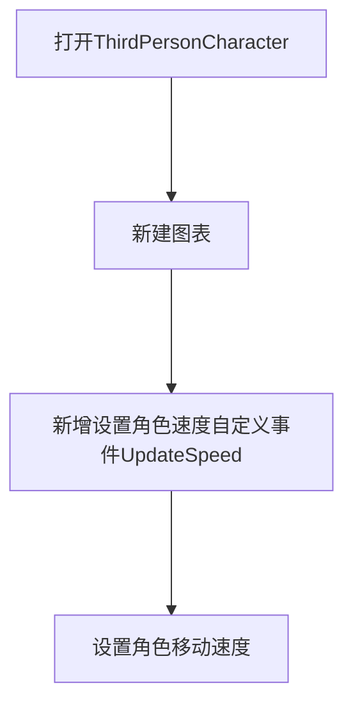
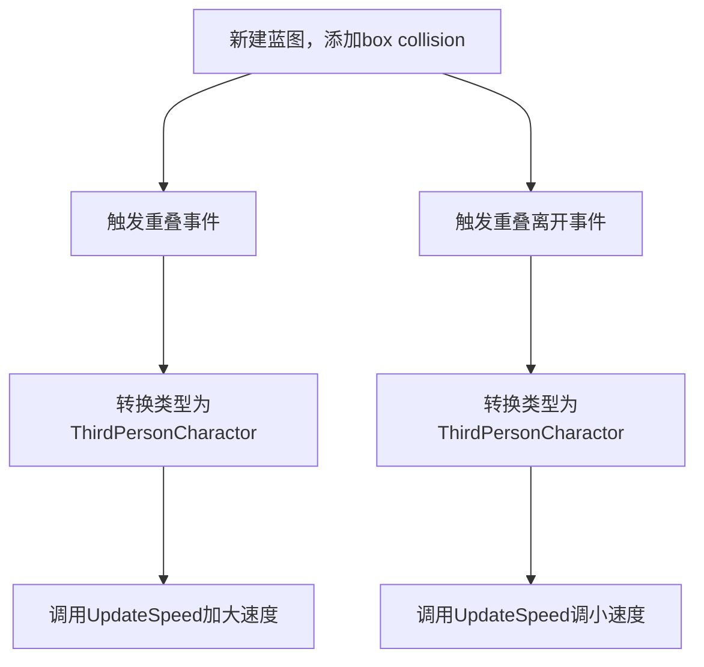

# 实现角色经过某一区域加速

## 效果说明
当角色经过某一区域的时候，角色移动速度变快，当角色离开这个区域的时候，速度恢复。

## 实现思路
通过两个蓝图来实现，用到`蓝图通信`：

### 蓝图1：现有的第三人称角色蓝图 `ThirdPersonCharacter`

### 蓝图2：新建加速区域蓝图

## 实现效果
<iframe src="https://player.youku.com/embed/XNjQ3MDQwNDQ2OA" scrolling="no" border="0" frameborder="no" width="800" height="450" framespacing="0" allowfullscreen="true"></iframe>

## 相关技术点
### 自定义事件
自定义事件（Custom Event）是一种特殊的 无返回值 的可执行节点，它可以在蓝图中被调用，用户可以自己定义，以组织逻辑或触发特定行为。

#### 1. 创建自定义事件
打开蓝图，在事件图表（`Event Graph`） 里 右键，输入 `Custom Event` 并选择 `Add Custom Event`。为事件命名（例如 `MyCustomEvent`）。

在 “详情” 面板中可以添加输入参数（可选）。
#### 2. 调用自定义事件
在蓝图任何需要调用的地方，右键搜索刚刚创建的 `MyCustomEvent`，并放置它。
连接它到执行流中即可触发该事件。

### 对象类型转化
用于检查和转换对象类型，例如判断某个 Actor 是否为 Character，然后执行特定逻辑。就像我们之前的开关门动作，和触发盒子重叠的动作只能是玩家控制的小白人角色，可以进行一个转化。

#### 用法：
`Cast To 节点`：将父类或 Actor 转换为特定子类。

获取对象（如 Hit Actor）。
连接到 Cast To 目标类型。
如果转换成功，则执行后续逻辑。
#### 示例：
Actor → Cast To Character → 成功时 执行角色相关逻辑。

## 扩展
- 实现角色经过熔岩区域会自动掉血
- 实现角色经过恢复区域自动回血
- 实现角色经过技能区域获取技能