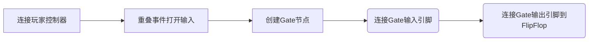
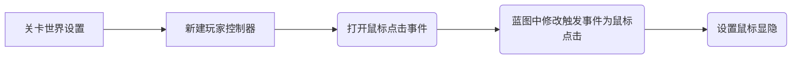

# 按键和鼠标实现开关门

## 效果说明
当玩家靠近目标门的时候，玩家可以通过按键或者点击鼠标来实现开关门。

## 实现思路
新接入一个`gate`门节点，用来控制事件的触发和关闭， 我们通过点击鼠标事件和键盘按键事件来进入门，通过开始触发盒子和结束触发盒子事件来控制门的打开和关闭。

需要注意，开始和盒子重叠的时候需要使输入键盘事件可用（`Enable Input`），结束重叠禁用（`Disable input`）;使用`FlipFlop`节点来使输出在`A`和`B`两个结果之间循环执行。

## 实现过程
### 1. 实现键盘开关门

<iframe src="https://player.youku.com/embed/XNjQ3MDAwOTAwNA" scrolling="no" border="0" frameborder="no" width="800" height="450" framespacing="0" allowfullscreen="true"></iframe>

### 2. 实现鼠标开关门 

<iframe src="https://player.youku.com/embed/XNjQ2MjMzMzAxNg" scrolling="no" border="0" frameborder="no" width="800" height="450" framespacing="0" allowfullscreen="true"></iframe>

## 相关事件
| 节点名称 | 含义 | 场景 |
|-------------|---------------| --------------------|
| FlipFlop  | 两个执行路径间循环切换 |激活时输出 A，第二次输出 B，之后交替执行。适用于需要反复切换状态的场景|
| Gate  | 执行流的动态开关 | 条件触发（如谜题解谜后允许执行后续逻辑）或动态控制循环流程|
| GetPlayerController  | 获取玩家控制器，控制玩家输入、视角和角色交互 |控制输入启用/禁用（Enable Input/Disable Input）；设置鼠标光标显示（Show Mouse Cursor ）|