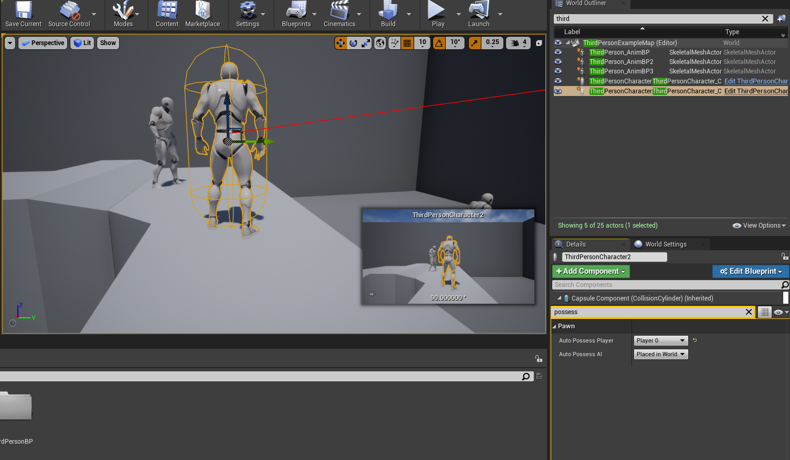
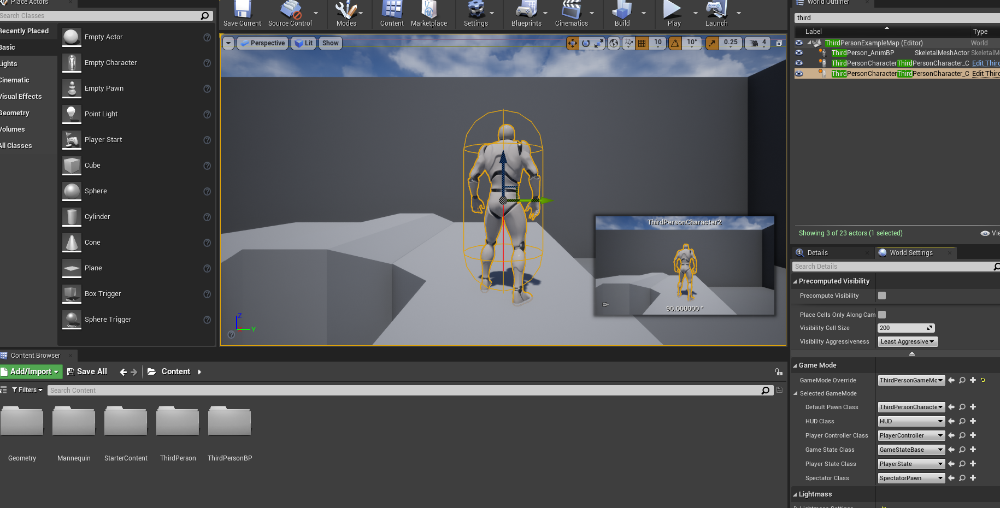
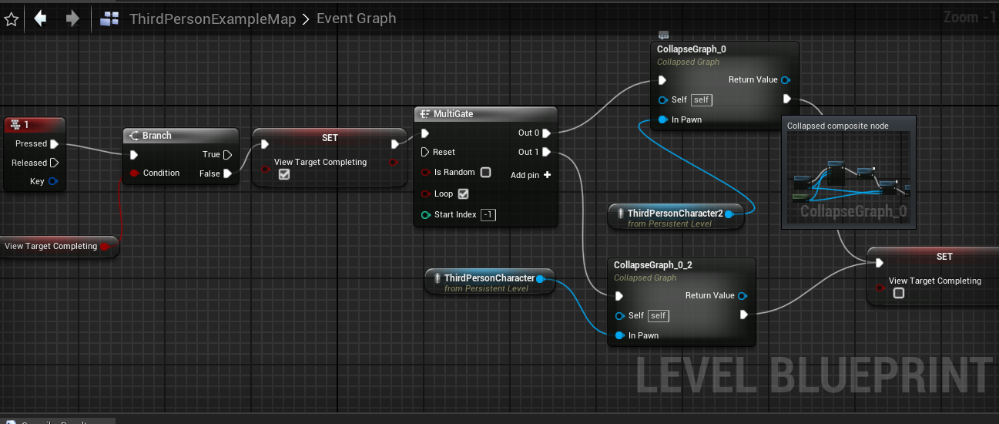
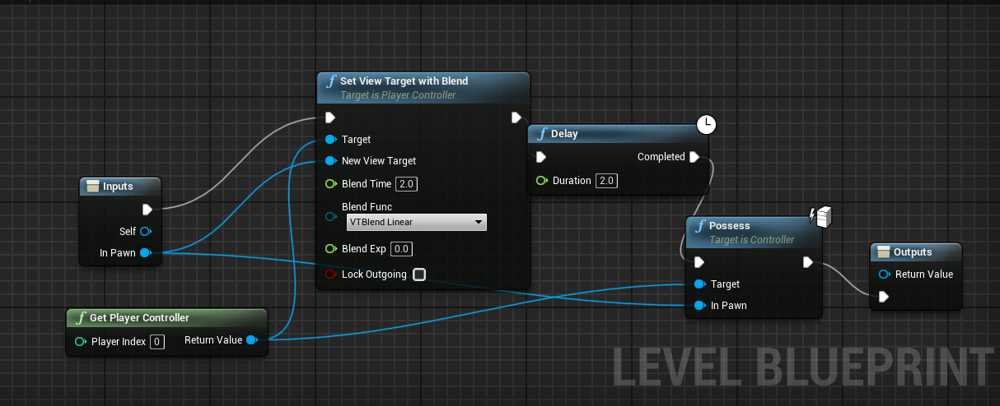

# 切换关卡中角色的控制权 

## 面板功能
### 多个游戏玩家，选择当前控制玩家
选中游戏中的角色，细节面板搜索`possess`, 设置Auto Possess Player

### 放置角色出生地`Player Start`，设置游戏模式
世界设置`World Settings`里面，找到`Game Mode`，选择第三人称游戏模式`ThirdPersonGameMode`，选择`Default Pawn Class`

## 关卡多个玩家切换
### 实现思路
按下数字键`1`，调用`multiGate`事件，循环输出到不同角色的切换事件。
#### 技巧 
- 可以使用`Set View Targe with Blend`节点来实现切换效果
- 可以使用`Collapse Node`折叠节点，或者`Collapse to Macro`折叠到宏（有`delay`节点和`gate`不能转函数），方便重复调用
- 可以判断动效完成状态，避免重复执行。

### 结果蓝图

### 实现过程 
<iframe src="https://player.youku.com/embed/XNjQ3MDc5Nzk5Mg" scrolling="no" border="0" frameborder="no" width="800" height="450" framespacing="0" allowfullscreen="true"></iframe>

## 相关事件
| 节点名称 | 场景 |
|-------------|---------------|
| MultiGate  | 复合门，可以执行循环、随机输出多个 |
| Set View Targe With Blend  | 视角转化效果 | 
| Delay  | 延迟执行 | 
| Possess  | 玩家控制器方法，设置当前控制当前角色 | 