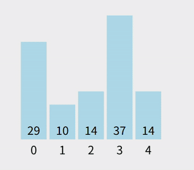

# 经典排序算法之冒泡排序
冒泡排序是一种非常基础且直观的排序算法，它的名字来自过程：
**相邻元素不断比较，较大的向后“冒泡”**。

## 核心思想：

1. **从头到尾**比较相邻元素；
2. 如果前一个比后一个大，就交换；
3. 完成一轮后，最大的元素一定会“冒”到最后；
4. 对剩余部分重复进行上述操作。

最终经过 N-1 轮后，整个数组有序。




---

## 示例过程

假设数组为：

```
[5, 1, 4, 2, 8]
```

### 第一轮比较：

* 5 > 1 → 交换 → `[1, 5, 4, 2, 8]`
* 5 > 4 → 交换 → `[1, 4, 5, 2, 8]`
* 5 > 2 → 交换 → `[1, 4, 2, 5, 8]`
* 5 < 8 → 不交换

最大的 8 已到最后位置。

### 第二轮：

* 1 < 4 → 不交换
* 4 > 2 → 交换 → `[1, 2, 4, 5, 8]`
* 4 < 5 → 不交换

最大值 5 到倒数第二位置。

以此类推……

---

## 冒泡排序的优化

冒泡排序最坏复杂度是 **O(n²)**。

为了减少不必要的比较，可以做一个**优化**：

* 如果某一轮没有发生交换，说明已经完全有序 → 可以提前结束。

---

## Golang 实现

```go
package main

import "fmt"

// BubbleSort 冒泡排序（优化版）
func BubbleSort(arr []int) {
	n := len(arr)
	for i := 0; i < n-1; i++ {
		swapped := false // 标记本轮是否发生交换

		for j := 0; j < n-1-i; j++ {
			if arr[j] > arr[j+1] {
				arr[j], arr[j+1] = arr[j+1], arr[j]
				swapped = true
			}
		}

		// 如果没有交换，说明数组已经有序
		if !swapped {
			break
		}
	}
}

func main() {
	arr := []int{5, 1, 4, 2, 8}
	fmt.Println("排序前:", arr)
	BubbleSort(arr)
	fmt.Println("排序后:", arr)
}
```

---

## 冒泡排序特点

| 特点        | 说明                 |
| --------- | ------------------ |
| **时间复杂度** | 最坏 O(n²)，最好 O(n)   |
| **空间复杂度** | O(1)，原地排序          |
| **稳定性**   | 稳定排序（相等元素不会改变相对位置） |
| **适用场景**  | 数据量小、对稳定性有要求的场景    |

---


## 参考
- https://leetcode.cn/discuss/post/3143970/xiang-jie-qi-da-chang-jian-pai-xu-suan-f-gqno/
- https://javaguide.cn/cs-basics/algorithms/10-classical-sorting-algorithms.html
- https://www.runoob.com/w3cnote/ten-sorting-algorithm.html
- https://github.com/MisterBooo/Article
- https://www.bilibili.com/video/BV1Ur4y1w7tv/