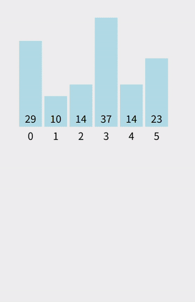

# 经典排序算法之插入排序

插入排序是一种**简单、高效的排序算法**，核心思想：**每次将一个元素插入到已排序部分的正确位置**。特别适用于**基本有序**或**小规模数据**。

## 基本思想

1. 将数组分为**已排序部分**和**未排序部分**。
2. 每次从未排序部分取出第一个元素，将其**插入到已排序部分的合适位置**。
3. 重复步骤 2，直到整个数组排序完成。

换句话说，插入排序就像我们整理扑克牌一样：手里已经有一部分排好序的牌，每次拿一张新牌插入到合适位置。



## 示例过程

数组 `[5, 2, 4, 6, 1, 3]` 排序过程：

1. 第 1 张牌 `5`：已排序部分 `[5]`
2. 第 2 张牌 `2`：插入 `[5]` → `[2, 5]`
3. 第 3 张牌 `4`：插入 `[2, 5]` → `[2, 4, 5]`
4. 第 4 张牌 `6`：插入 `[2, 4, 5]` → `[2, 4, 5, 6]`
5. 第 5 张牌 `1`：插入 `[2, 4, 5, 6]` → `[1, 2, 4, 5, 6]`
6. 第 6 张牌 `3`：插入 `[1, 2, 4, 5, 6]` → `[1, 2, 3, 4, 5, 6]`


---

## Go 语言实现

```go
package main

import (
	"fmt"
)

// InsertionSort 实现插入排序
func InsertionSort(arr []int) {
	n := len(arr)
	for i := 1; i < n; i++ {
		key := arr[i]        // 待插入元素
		j := i - 1
		// 将大于 key 的元素向后移动
		for j >= 0 && arr[j] > key {
			arr[j+1] = arr[j]
			j--
		}
		// 插入 key
		arr[j+1] = key
	}
}

func main() {
	arr := []int{5, 2, 4, 6, 1, 3}
	fmt.Println("排序前：", arr)
	InsertionSort(arr)
	fmt.Println("排序后：", arr)
}
```

### 输出结果

```
排序前： [5 2 4 6 1 3]
排序后： [1 2 3 4 5 6]
```
---

## 插入排序特点

* 时间复杂度：O(n²)（最坏情况），O(n)（最好情况，数据已经有序）
* 空间复杂度：O(1)（原地排序）
* 稳定性：**稳定**（相等元素不会改变顺序）
---

## 参考
- https://leetcode.cn/discuss/post/3143970/xiang-jie-qi-da-chang-jian-pai-xu-suan-f-gqno/
- https://javaguide.cn/cs-basics/algorithms/10-classical-sorting-algorithms.html
- https://www.runoob.com/w3cnote/ten-sorting-algorithm.html
- https://github.com/MisterBooo/Article
- https://www.bilibili.com/video/BV1Ur4y1w7tv/