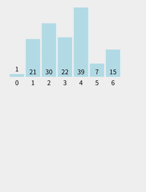

# 经典排序算法之快速排序

快速排序是一种 **分治法** 思想的排序算法，也是实际工程中使用最多的排序方法之一。

## 核心思想

1. **选择一个基准元素（pivot）**。
2. 将数组分成两部分：

   * 左边所有元素 **比 pivot 小**
   * 右边所有元素 **比 pivot 大**
3. 对左右两个子数组继续进行快速排序（递归）。
4. 最终左右子数组排序完成后合并。

时间复杂度平均为 **O(n log n)**，最坏情况为 **O(n²)**（如选择很差的 pivot）。

---

## 快速排序的分区（partition）过程

这是快排最关键的步骤。

假设数组为：

```
[8, 3, 1, 7, 0, 10, 2]
```

选择最后一个作为 pivot：

```
pivot = 2
```

分区目标：

* 所有小于 pivot 的放左边
* 所有大于 pivot 的放右边

分区完成后可能变成：

```
[1, 0, 2, 8, 7, 10, 3]
         ↑
       pivot 正确位置
```

再分别对 `[1, 0]` 和 `[8, 7, 10, 3]` 继续快排。



---

## 快速排序的主要优势

* **平均性能非常好：O(n log n)**
* **原地排序**（space O(1)）
* 实际工程中比堆排序、归并排序的常数更小，性能更快
* 周期性访问局部内存，CPU cache 命中率高

---

## Golang 实现
我们先写一个基础版本的实现：
```go
func quickSort(arr []int) []int {
	if len(arr) < 2 {
		return arr
	}

	len := len(arr)
	pivot := arr[0]
	leftArr := []int{}
	rightArr := []int{}
	for i := 1; i < len; i++ {
		if arr[i] > pivot {
			rightArr = append(rightArr, arr[i])
		} else {
			leftArr = append(leftArr, arr[i])
		}
	}

	leftArr = append(leftArr, pivot)
	leftArr = quickSort(leftArr)
	rightArr = quickSort(rightArr)
	arr = append(leftArr, rightArr...)
	return arr
}
```
这种方法，会返回一个新的数组，原数组不变。我们使用数据交换来优化一下，保持原数组不变，实现如下：

```go
func quickSort(arr []int) {
	if len(arr) < 2 {
		return
	}

	left, right := 0, len(arr)-1
	pivot := arr[left]
	for left < right {
		for left < right && arr[right] >= pivot {
			right--
		}
		arr[left] = arr[right]
		for left < right && arr[left] <= pivot {
			left++
		}
		arr[right] = arr[left]
	}
	arr[left] = pivot
	quickSort(arr[:left])
	quickSort(arr[left+1:])
	return
}
```


实际上，工业生产中常见的快排一般有两种分区法：
- Lomuto 分区法
- Hoare 分区法。

### 实现：Lomuto 分区法

Lomuto分区逻辑：

1. **选择最后一个元素作为 pivot**
2. `i` 指向“小于 pivot 区间”右边界（初始 low）
3. 遍历 j = low → high-1
   如果 `arr[j] < pivot`：

   * 交换 arr[i] 和 arr[j]
   * i++
4. 最终将 pivot 放到 arr[i]
5. 返回 i 作为 pivot 的最终位置
   

特点：

* 单指针 i + 一个遍历指针 j
* 处理重复元素性能较差（全部落在右侧）
* pivot 最终位置是正确排序中的真实位置。
* 分区后的结果如下：

```
[ < pivot ]  pivot  [ > pivot ]
```

实现代码：
```go
package main

import "fmt"

// 快速排序入口
func QuickSort(arr []int) {
	quickSort(arr, 0, len(arr)-1)
}

// 递归函数
func quickSort(arr []int, low, high int) {
	if low < high {
		// 分区，返回 pivot 的正确位置
		p := partition(arr, low, high)
		// 对 pivot 左右部分分别递归排序
		quickSort(arr, low, p-1)
		quickSort(arr, p+1, high)
	}
}

// Lomuto 分区法
func partition(arr []int, low, high int) int {
	pivot := arr[high]  // 基准元素选择最后一个
	i := low            // i 指向小于 pivot 的区域

	for j := low; j < high; j++ {
		if arr[j] < pivot {
			arr[i], arr[j] = arr[j], arr[i]
			i++
		}
	}

	// 最后将 pivot 放到正确位置
	arr[i], arr[high] = arr[high], arr[i]
	return i
}

func main() {
	arr := []int{8, 3, 1, 7, 0, 10, 2}
	fmt.Println("排序前：", arr)
	QuickSort(arr)
	fmt.Println("排序后：", arr)
}
```
### 实现：Hoare 分区法

Hoare分区逻辑：

1. **选择第一个元素作为 pivot**
2. 左指针 i 从左往右找 ≥ pivot 的元素
3. 右指针 j 从右往左找 ≤ pivot 的元素
4. 若 i < j，交换 arr[i] 和 arr[j]
5. 若 i ≥ j，返回 j 作为分区界限


特点：

* 双指针i、j互相靠近
* 更少的交换次数，平均性能更佳
* pivot 不保证直接落在正确位置
* 分区结果如下形式：

```
[ ≤ pivot 区域 ] | [ ≥ pivot 区域 ]
```

实现代码：
```go
package main

import "fmt"

// 快速排序入口
func QuickSort(arr []int) {
	quickSort(arr, 0, len(arr)-1)
}

// 快速排序递归
func quickSort(arr []int, low, high int) {
	if low < high {
		// 使用 Hoare partition
		p := hoarePartition(arr, low, high)
		quickSort(arr, low, p)
		quickSort(arr, p+1, high)
	}
}

// Hoare 分区法
func hoarePartition(arr []int, low, high int) int {
	pivot := arr[low] // 选择第一个元素作为 pivot
	i := low - 1
	j := high + 1

	for {
		// i 向右移动，找 >= pivot 的元素
		for {
			i++
			if arr[i] >= pivot {
				break
			}
		}

		// j 向左移动，找 <= pivot 的元素
		for {
			j--
			if arr[j] <= pivot {
				break
			}
		}

		// 指针交叉，分区结束
		if i >= j {
			return j
		}

		// 交换
		arr[i], arr[j] = arr[j], arr[i]
	}
}

func main() {
	arr := []int{8, 3, 1, 7, 0, 10, 2}
	fmt.Println("排序前：", arr)
	QuickSort(arr)
	fmt.Println("排序后：", arr)
}
```
---

### 运行结果示例

```
排序前： [8 3 1 7 0 10 2]
排序后： [0 1 2 3 7 8 10]
```

---

## 快速排序特点

| 特点          | 描述                                   |
| ----------- | ------------------------------------ |
| **时间复杂度**   | 最好 O(n log n)，最坏 O(n²)，平均 O(n log n) |
| **空间复杂度**   | O(log n)（递归栈）                        |
| **是否稳定**    |  不稳定                                |
| **是否原地排序**  | 是                                 |


---


## 参考
- https://leetcode.cn/discuss/post/3143970/xiang-jie-qi-da-chang-jian-pai-xu-suan-f-gqno/
- https://javaguide.cn/cs-basics/algorithms/10-classical-sorting-algorithms.html
- https://www.runoob.com/w3cnote/ten-sorting-algorithm.html
- https://github.com/MisterBooo/Article
- https://www.bilibili.com/video/BV1Ur4y1w7tv/