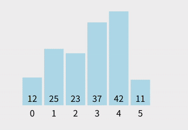

# 经典排序算法之选择排序
选择排序是一种**简单直观的排序算法**，它的核心思想是“**每次找到最小值并交换**”。

## 基本思想
1. **从待排序数组中找到最小（或最大）元素**。
2. 将该元素与数组的**第一个位置元素交换**。
3. 对剩余的元素重复上述过程，直到整个数组排序完成。

换句话说，每次循环会把**未排序部分的最小值放到当前排序位置**。




---

## 步骤举例

假设数组为 `[29, 10, 14, 37, 13]`：

1. 第一次循环：找到最小值 `10`，与第一个元素 `29` 交换 → `[10, 29, 14, 37, 13]`
2. 第二次循环：在 `[29, 14, 37, 13]` 中找到最小值 `13`，与第二个元素 `29` 交换 → `[10, 13, 14, 37, 29]`
3. 第三次循环：在 `[14, 37, 29]` 中最小值是 `14`，位置正确，无需交换 → `[10, 13, 14, 37, 29]`
4. 第四次循环：在 `[37, 29]` 中最小值是 `29`，与 `37` 交换 → `[10, 13, 14, 29, 37]`
5. 完成排序。

---

## Go 语言实现

```go
package main

import (
	"fmt"
)

// SelectionSort 实现选择排序
func SelectionSort(arr []int) {
	n := len(arr)
	for i := 0; i < n-1; i++ {
		minIndex := i
		// 找到剩余部分的最小值索引
		for j := i + 1; j < n; j++ {
			if arr[j] < arr[minIndex] {
				minIndex = j
			}
		}
		// 交换当前元素和最小值
		if minIndex != i {
			arr[i], arr[minIndex] = arr[minIndex], arr[i]
		}
	}
}

func main() {
	arr := []int{29, 10, 14, 37, 13}
	fmt.Println("排序前：", arr)
	SelectionSort(arr)
	fmt.Println("排序后：", arr)
}
```

### 输出结果：

```
排序前： [29 10 14 37 13]
排序后： [10 13 14 29 37]
```

---

## 选择排序特点

* 时间复杂度：O(n²)
* 空间复杂度：O(1)（原地排序）
* 稳定性：**不稳定**（因为交换可能改变相等元素的顺序）
---

## 参考
- https://leetcode.cn/discuss/post/3143970/xiang-jie-qi-da-chang-jian-pai-xu-suan-f-gqno/
- https://javaguide.cn/cs-basics/algorithms/10-classical-sorting-algorithms.html
- https://www.runoob.com/w3cnote/ten-sorting-algorithm.html
- https://github.com/MisterBooo/Article
- https://www.bilibili.com/video/BV1Ur4y1w7tv/