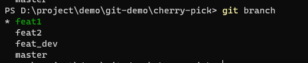
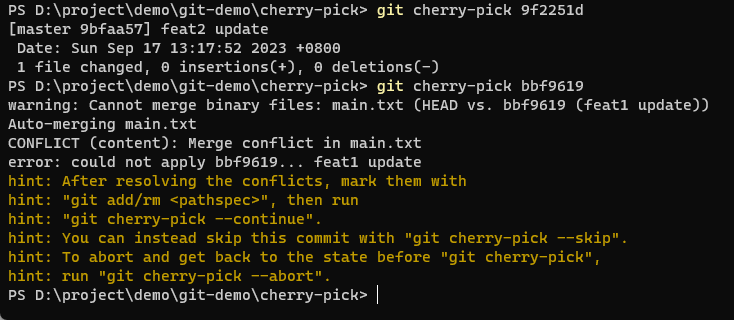

# cherry-pick的作用以及如何解决冲突

## 引言
在 Git 版本控制系统中，`cherry-pick`允许开发者**选择性地将其他分支的提交应用到当前分支**。其工作原理是通过选择性地复制和合并单个提交，而无需将整个分支合并到目标分支中。
官方文档: [https://git-scm.com/docs/git-cherry-pick](https://git-scm.com/docs/git-cherry-pick)

## 使用场景
### 场景1：当前开发分支部分功能需要紧急上线
切换到新的功能分支，将之前的开发分支相关commit拣选应用
```bash
# 应用多个连续提交
git checkout main
git cherry-pick <commitHash1> <commitHash2>
```
### 场景2： 跨分支修复bug
**示例**：在 `feature` 分支修复的 Bug 需要同步到 `main` 分支：
```bash
git checkout main
git cherry-pick abc1234  # 应用 feature 分支的修复提交
```
### 场景3： 多环境同步
将测试环境验证通过的提交快速应用到预发布或生产环境
```bash
# 切换到测试环境
git checkout develop

# 合并开发功能分支
git merge feature

# 将这次合并的提交拣选到生产
git checkout master
git cherry-pick <merge-commit-hash>

```

## 相关命令
```bash
# 1、拣选某个分支的单次提交到当前分支
git cherry-pick <commitID>

# 2、拣选某个分支的多次提交到当前分支
git cherry-pick <commit1> <commit2> <...>

# 3、拣选某个分支上自分叉点以来所有提交应用到当前分支
git cherry-pick <branchName>

# 4、（发生冲突）解决完冲突之后继续拣选
git cherry-pick --continue

# 5、（发生冲突）恢复操作之前状态，放弃自己做的解决冲突修改
git cherry-pick --abort

# 6、（发生冲突）保留已解决部分，并退出拣选
git cherry-pick --quit

```
## 发生冲突并解决
### 模拟冲突产生
同时修改一个文件，git cherry-pick就有可能会发生冲突。我们有下面这几个分支：

> git仓库有一个main.txt文件。feat_dev分支基于master分支创建。feat1和feat2分支基于feat_dev分支创建。

当feat1和feat2同时修改了main.txt文件。将feat1和feat2直接`cherry-pick`到master分支，第二次`cherry-pick`就会发生冲突。

**在不同的分支修改并提交**


**分别cherry-pick到master**


可以看到，第二次拣选的时候发生了冲突。

### 解决冲突
解决冲突有两种方式：

**方法一：**
master 拣选 feat分支的最后一次提交，发生冲突之后，手动解决并提交，下次拣选就不会有问题了。

**方法二：**
在feat1分支拣选master分支的最后一次提交记录。发现发生冲突并解决。


因为实际我们的修改需要托管到gitlab，大部分开发者是没有master分支的推送权限的，所以我们采用第二种方式：

1、找到master分支main.txt的最后一次提交：


2、复制commitID，切换到功能分支feat1，拣选这次提交：


发现冲突，解决冲突并提交。


