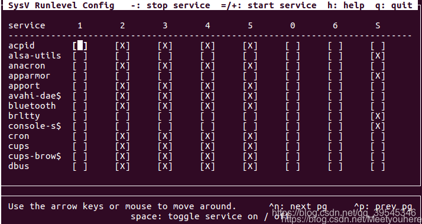

# linux系统（ubuntu19）编译安装lnmp环境
## 前言
我们的服务器环境的部署，或者是开发环境的部署，常常会要求固定版本。比如开发服务器的环境和生产服务器的环境要求一致。这种情况下我们的lnmp一键安装似乎不太好用呢。那就老老实实单独部署吧！

## 安装mysql
1. 先下载：[https://dev.mysql.com/downloads/mysql](https://dev.mysql.com/downloads/mysql)
2. 再解压：

```bash
tar –xvf mysql-server_5.6.28-1ubuntu14.04_amd64.deb-bundle.tar
```
	解压后得到一系列的.deb文件。
	libmysqlclient18_5.6.28-1ubuntu14.04_amd64.deb
	libmysqlclient-dev_5.6.28-1ubuntu14.04_amd64.deb
	.....
3. 安装解压后的所有的deb文件
	
```bash
sudo dpkg -i mysql-common_5.6.28-1ubuntu14.04_amd64.deb
sudo dpkg -i libmysqlclient18_5.6.28-1ubuntu14.04_amd64.deb
sudo dpkg -i libmysqlclient-dev_5.6.28-1ubuntu14.04_amd64.deb
```
	安装过程中可能会需要安装依赖。那么我们安装完依赖再重新安装
	安装依赖：
	
```bash
sudo apt --fix-broken install 依赖包1 依赖包2
```

> 注：安装mysql-server的时候需要输入mysql root用户的密码

4. 所有文件安装成功之后，查看版本
```bash
sudo mysql --version
```
5. 设置mysql程序开启自启动
	没有sysv-rc-conf工具的话去下载
	

```bash
sudo apt install sysv-rc-conf
```
报错的话参考：[https://blog.csdn.net/qq_39545346/article/details/106566782](https://blog.csdn.net/qq_39545346/article/details/106566782)
执行：

```bash
sudo sysv-rc-conf
```

ctrl +n 向下翻页 ctrl +p 向上翻页
0表示系统停机状态
1表示单用户或系统维护状态
2-5表示多用户状态
6表示重新启动

将mysql这一行除了停机状态不设置，其他都设置为启动。
然后按q退出

## 安装nginx
1. 先下载：[http://nginx.org/en/download.html](http://nginx.org/en/download.html)
	ftp上传，或者在线下载：
```bash
wget http://nginx.org/download/nginx-1.16.1.tar.gz
```

2. 再解压

```bash
tar -zxvf nginx-1.16.1.tar.gz
```

4. 安装相关依赖，可能需要安装的依赖：

```bash
apt install gcc
apt install libpcre3 libpcre3-dev
apt install openssl libssl-dev libperl-dev
apt install zlib1g zlib1g-dev
```

5. 配置、编译、安装

```bash
cd nginx-1.16.1
./configure
```
如果提示需要安装其他依赖，自行添加镜像源。apt-get安装或者直接编译安装相关依赖。

```bash
make
make install
```

6. 建立nginx服务管理文件
参考博客:[https://www.cnblogs.com/dreamofprovence/p/11789115.html](https://www.cnblogs.com/dreamofprovence/p/11789115.html)
```bash
sudo vim lib/systemd/system/nginx.service
```

将下面的代码写入nginx.service文件
```bash
[Unit]
Description=nginx - high performance web server
After=network.target remote-fs.target nss-lookup.target
[Service]
Type=forking
ExecStart=/usr/local/nginx/sbin/nginx -c /usr/local/nginx/conf/nginx.conf
ExecReload=/usr/local/nginx/sbin/nginx -s reload
ExecStop=/usr/local/nginx/sbin/nginx -s stop
[Install]
WantedBy=multi-user.target
```
7. 启动服务，开机自启动

```bash
systemctl start nginx.service
systemctl enable nginx.service
```
	注：常用命令
	systemctl start nginx.service      //启动nginx服务
	systemctl enable nginx.service   //设置开机自动启动
	systemctl disable nginx.service  //停止开机自动启动
	systemctl status nginx.service   //查看状态
	systemctl restart nginx.service  //重启服务
	systemctl list-units --type=service  //查看所有服务

8. 浏览器输入localhost。有nginx的html界面显示的话代表成功啦。

## 安装PHP以及配置nginx相关支持
1. 老一套，去官网下载。解压，进入文件夹。
2. 配置
```bash
sudo ./configure --prefix=/usr/local/php --with-mysqli=mysqlnd --with-pdo-mysql=mysqlnd --with-iconv --with-zlib --with-openssl --with-curl --enable-fpm --enable-mbstring --with-pdo-mysql --with-mysqli
```

> 注：可能会出现需要安装一些依赖。

		

```bash
sudo apt-get install libxml2-dev
sudo apt-get install libcurl4-openssl-dev
```
3. make && make install
4. 配置相关文件

```bash
sudo cp php.ini-production /usr/local/lib/php.ini
sudo cp /usr/local/php/etc/php-fpm.conf.default /usr/local/php/etc/php-fpm.conf
sudo cp ./sapi/fpm/init.d.php-fpm /etc/init.d/php-fpm
sudo cp /usr/local/php/etc/php-fpm.d/www.conf.default /usr/local/php/etc/php-fpm.d/www.conf
```
修改web用户组为www

```bash
sudo vim www.conf
```
将原来的
	user = nobody
	group = nobody
改为
user = www
group = www

新建www用户和用户组

```bash
sudo groupadd www
sudo useradd www -g www
```
启动php-fpm服务

```bash
systemctl start php-fpm.service
```
5. 配置nginx支持php
打开nginx.conf，找到下面的代码，取消注释，按照自己的实际项目需要配置。

```bash
        location ~ \.php$ {
            root           html;
            fastcgi_pass   127.0.0.1:9000;
            fastcgi_index  index.php;
            fastcgi_param  SCRIPT_FILENAME  /scripts$fastcgi_script_name;
            include        fastcgi_params;
        }
```

6. 配置nginx支持pathinfo
首先你要知道pathinfo是个啥。不知道的话去问度娘。
配置的话很简单，打开nginx.conf，找到配置支持php的server项。如上。然后做出以下两处修改：

```bash
		location ~ \.php(.*)$ { #修改1： 正则搜索XX.php后面的地址
            root           /home/www;
            fastcgi_pass   127.0.0.1:9000;
            fastcgi_index  index.php;
            fastcgi_param  SCRIPT_FILENAME  $document_root$fastcgi_script_name;
            fastcgi_param PATH_INFO $1; #修改2：设置pathinfo变量
            include        fastcgi_params;
        }

```
注意：此处fastcgi_param 设置变量应该在include之前。

6. 配置nginx隐藏index.php入口文件
找到nginx.conf里面的server配置项中的location项。作如下一处修改：

```bash
		location / {
            # 添加重写规则
            if (!-e $request_filename) {
                rewrite  ^(.*)$  /index.php?s=/$1  last;
            }
            root   html;
            index index.php  index.html index.htm;
        }

```
重启nginx

7. nginx 配置域名访问，配置ip访问，配置https。
	没啥可讲的，nginx.conf里面都有注释的实例配置。打开注释，将里面的参数修改成自己的。配置本地域名的话，记得修改 /etc/hosts文件。
	

>    注意：一个基本的小常识：每次修改完配置，都要重启配置文件哦。


