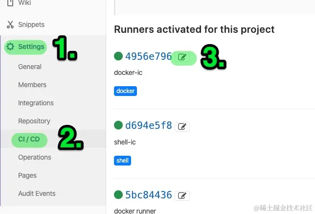
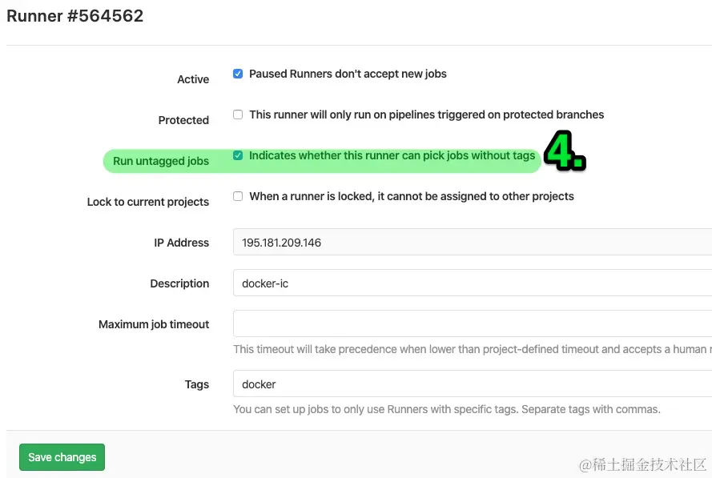

# 实现gitlab CI/CD工作流

## 写在前面
**gitlab**是中小型公司托管git仓库代码的常用工具之一，其中gitlab的CI/CD也是非常的常用和方便。我们可以用CI/CD来进行项目的构建以及代码的检测和部署。如何使用它呢？这里贴上详细的中文文档和英文文档地址。

- 中文文档：https://docs.gitlab.cn/
- 英文文档：https://docs.gitlab.com/

如果你想快速的入手就搭建一套完整的项目CI/CD流程，请看此篇教程，其中包括简单的部署过程，以及常见问题的解决方法。

****

## 基本概念

### CI/CD

CI/CD（Continuous Integration/Continuous Deployment）是一种软件开发实践，旨在通过自动化和持续集成来提高开发团队的效率。

1.  **持续集成（Continuous Integration）：** 这是指将开发人员的代码变更集成到共享的主干代码库中。GitLab CI允许开发者在每次提交代码时自动运行构建和测试。这有助于及早发现潜在的问题，并确保新代码与现有代码库兼容。
1.  **持续部署（Continuous Deployment）：** 这是指自动将通过持续集成阶段的通过的代码部署到生产环境。GitLab CI/CD提供了自动化的部署流程，以减少手动干预，提高交付速度，同时保持系统的稳定性。

GitLab的CI/CD使用`.gitlab-ci.yml`文件定义构建、测试和部署的流程。这个文件描述了CI/CD流水线的各个阶段，包括需要运行的脚本、依赖关系和触发条件等。
****

### gitlab-runner

GitLab Runner是GitLab CI/CD系统中的一个组件，负责运行构建和部署作业。它是一个轻量级的代理程序，可以安装在开发者的计算机、虚拟机、物理服务器或容器中。GitLab Runner通过连接到GitLab实例，并执行定义在项目的`.gitlab-ci.yml`文件中的作业。
需要注意的是：gitlab-ci/cd使用 **项目根目录的`.gitlab-ci.yml`文件**进行配置和管理动作等等，该文件中的命令都是运行在gitlab-runner所在的物理（或虚拟）环境中的。

`.gitlab-ci.yml`示例文件：https://docs.gitlab.com/ee/ci/examples/


****

## 部署过程

### 安装gitlab-runner

这里只介绍linux - RHEL/CentOS/Fedora 系统的安装，其他环境请查阅官方文档。

准备一个服务器来运行gitlab-runner。

- 将gitlab-runner添加到yum库
```bash
curl -L "https://packages.gitlab.com/install/repositories/runner/gitlab-runner/script.rpm.sh" | sudo bash
```
- yum安装
```bash
sudo yum install gitlab-runner
```
安装成功！

****

### 注册gitlab-runner

运行注册命令：
```bash
sudo gitlab-runner register
```
根据提示输入相应的值，其中主要参数url和token在这里:

找到你的项目-> setting -> CI/CD -> Runners


其他参数自行配置。

 - 注意：如果配置了tag，后续有个坑。后面会说。

当我们填完所有配置，gitlab-runner就注册成功了，配置文件默认在`/etc/gitlab-runner/config.toml`，后续需要改配置可以直接修改配置文件，重启gitlab-runner。

### 将gitlab-runner关联到项目

首先需要将gitlab-runner操作用户（默认root）的ssh公钥配置在gitlab平台的项目中。


然后确认runner在项目里是可用且活跃状态：


****

## 实现CI/CD “跑”起来

首先我们平台上配置一下gitlab流水线pipelines的策略：


后面我们编写`.gitlab-ci.yml`文件，这块直接上示例了，大家根据自己需求编写。注意：这个文件中的所有命令都是运行在gitlab-runner上的。
```yml
stages:
  - Deploy-server

deploy-server:
  stage: Deploy-server
  script:
    - rm -rf /home/ap/safm/test_struct/ && \
    - cd /home/ap/safm/ && git clone -b master ssh://git@0.0.0.0:2022/web/test_struct.git || exit 1 && \
    - cd /home/ap/safm/test_struct/server/cmd && \
    - export CGO_ENABLED=0 && export GOOS=linux && export GOARCH=amd64 && \
    - go build -ldflags "-w -s -X 'bstar.com/version.vInfo=$(date) $(git log --format=%h -n 1)'" -o test_struct || exit 2 && \
    - if pgrep -x test_struct >/dev/null; then pkill -9 -x test_struct; fi
    - /bin/cp -rfp test_struct /home/ap/safm/ccbc/web/test_struct/ || exit 3 && \
    - cd /home/ap/safm/ccbc/web/test_struct/ && chmod +x test_struct && \
    - nohup ./test_struct </dev/null &>/dev/null & 
    - cd /home/ap/safm/test_struct/ && rm -rf ./.git && rm -rf ./server

  only:
    - master

```
其中stages表示ci/cd要运行的步骤。only - master表示只有在master分支做改变才会运行gitlab CI/CD

写好之后，大家可以用CI Lint检测文件有没有语法错误：

****

## 常见问题FAQ

**1）  job is stuck because the project doesn't have any runners online assigned to it.Go to project CI settings**

因为创建gitlab-runner时，我们添加了标签，然而合并的时候没有指定标签，所以需要编辑runner,取消标签也可以执行jobs。






**2) SSH executor... ERROR: Preparation failed: ssh command Connect() error: ssh Dial() error: ssh: handshake failed: knownhosts: key is unknown**

部署密钥填上就行了。


**3)Using SSH executor... ERROR: Preparation failed: ssh command Connect() error: getting host key callback: open /root/.ssh/known_hosts: no such file or directory**
   这是因为SSH连接到相同的远程主机时，SSH 客户端会检查 `known_hosts` 文件，以确保远程主机的公钥没有发生变化，有助于防止中间人攻击。我们可以预先在gitlab-runner的环境中，使用该用户运行一下ssh root@gitlab的ip。
   
   或者直接跳过：配置`/etc/gitlab-runner/config.toml`，新增[runners.ssh]配置
   
   ```toml
       disable_strict_host_key_checking = true
   ```
   

**4) 护进程运行程序gitlab-runner的状态会阻塞，导致pipelines一直在部署中**

gitlab-runner环境和运行程序的环境状态无法同步，我们将输入和输出的信息都忽略就可以了。

```bash
nohup ./test_struct </dev/null &>/dev/null & 
```
