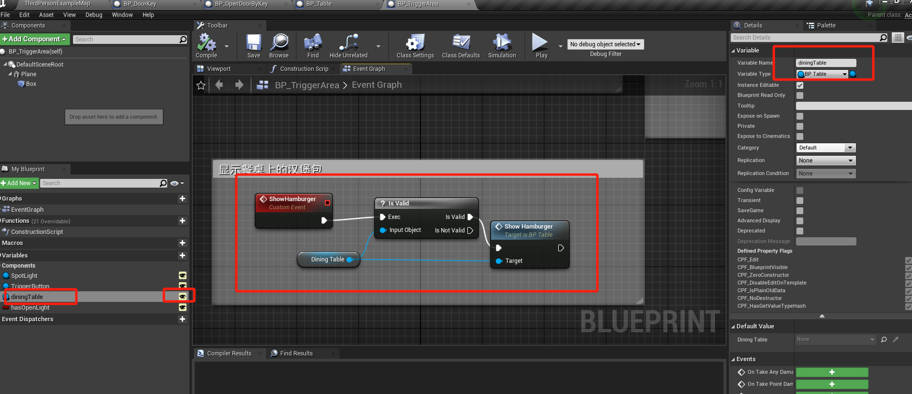
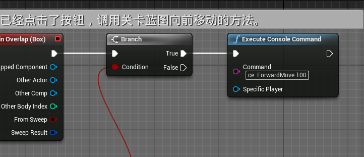

# 蓝图通信总结

这里总结一下蓝图中通信的几种方法。

## 1. `GetAllAcorsOfClass`节点
下拉选择要获取的蓝图类名称，输出`Out Actors`调用获取`get (a copy)`获取他的复制体。下标为0表示获取第一个蓝图类实体。

> 注意：需要先选择蓝图类，再调用Get方法。

## 2. 添加蓝图类引用变量
新建一个变量，变量类型选择目标蓝图类的引用。打开变量后面的小眼睛，然后到关卡中，在目标变量类目下，修改变量的值为场景中的某个变量的实体。

> 注意：使用变量的时候，最好先判断是否合法。

## 3. `ExecuteConsoleCommand`调用关卡蓝图中事件
在`Command`中输入 `ce {关卡蓝图事件名称} {参数}`

