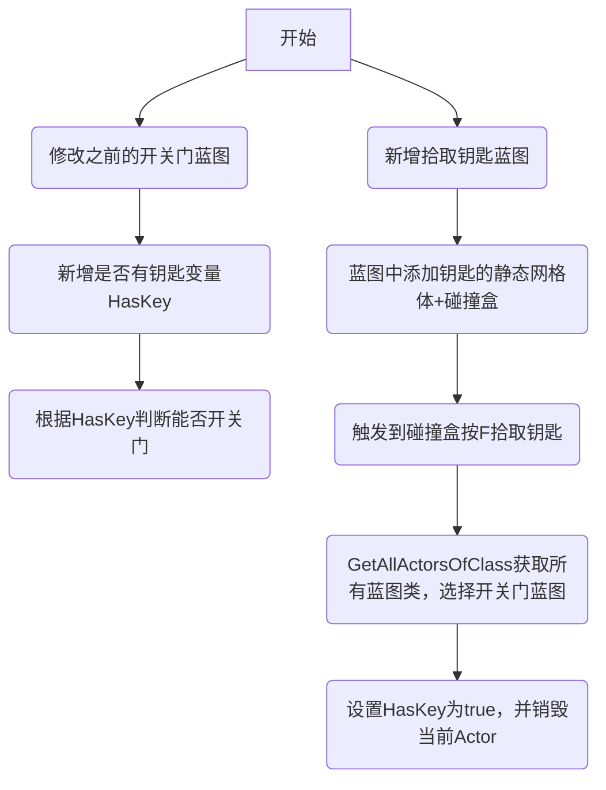
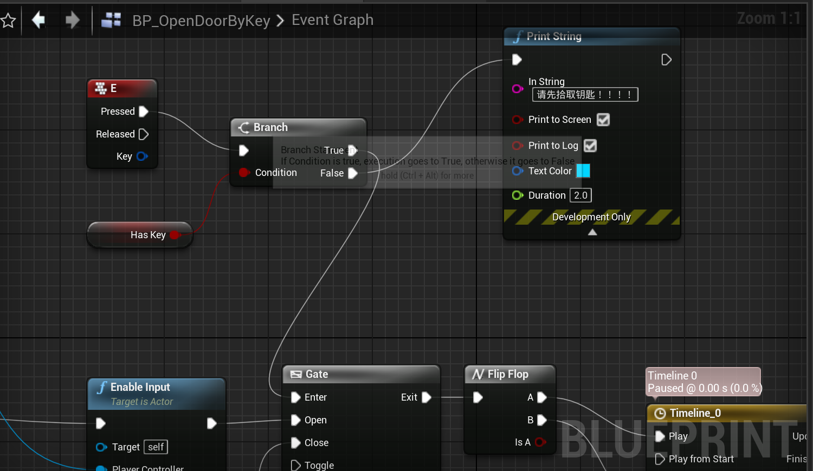

# 通过拾取钥匙实现开关门

## 效果说明
只有当玩家到固定地点按F拾取钥匙，然后再到达目标门的时候，按E门才会打开。

## 实现思路
将之前开关门的蓝图做修改。有钥匙才可以开关门。新增拾取钥匙蓝图，当玩家靠近才可以拾取，拾取完设置用户已经有钥匙了，并且销毁当前钥匙。

## 实现过程

### 1. 修改开关门蓝图，新增一个Bool变量HasKey，默认false，根据它的值判断是否可以开关门

### 2. 新增一个拾取钥匙蓝图，添加钥匙组件和碰撞盒，并完成拾取钥匙的逻辑

### 效果展示
<iframe src="https://player.youku.com/embed/XNjQ3MDI2NjU0MA" scrolling="no" border="0" frameborder="no" width="800" height="450" framespacing="0" allowfullscreen="true"></iframe>

## 说明
- 注意，GetAllActorsOfClass获取到蓝图类之后，需要调用Get获取数组中的某个开关门的实例，必须为该**实例的复制体**而不是引用，否则会有兼容性问题。

## 相关事件
| 节点名称 | 含义 |
|-------------|---------------|
| Lerp  | 实现A到B的平滑过渡 |
| DestroyActor  | 销毁Actor |
| GetAllActorsOfClass  | 蓝图通信：获取其他蓝图 |